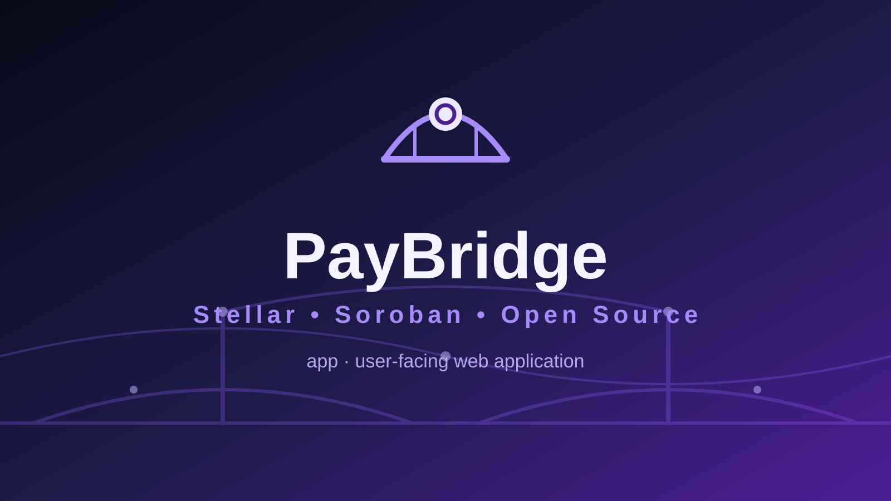
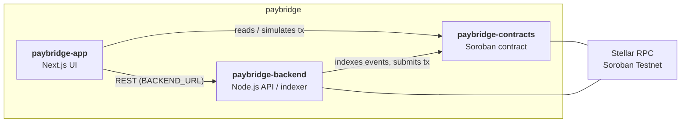

<p align="center">
  
</p>

<h1 align="center">PayBridge — paybridge-app</h1>

<p align="center"><i>Merchant payment intents and checkout infrastructure.</i></p>

<p align="center">
[](LICENSE)
[](.github/workflows/ci.yml)
[](#tech-stack)
[](#security)
</p>

## Why this exists

Merchant payment intents and checkout infrastructure. This repository is the **user-facing web application** of the three-repo **PayBridge** system.

## Where it fits

- [`paybridge-contracts`](../paybridge-contracts) — on-chain Soroban state and authorization.
- [`paybridge-app`](../paybridge-app) — user-facing web application. ← you are here
- [`paybridge-backend`](../paybridge-backend) — off-chain indexing/API and operational services.



## Features

- Next.js 15 App Router landing page (`app/page.tsx`)
- Stellar network summary helper (`lib/stellar.ts`) built on `@stellar/stellar-sdk`
- Strict TypeScript configuration with `reactStrictMode`
- Environment-driven configuration for network, RPC, contract and backend URL
- `next lint` and `node --test` wired into npm scripts

## Tech stack

| Layer | Choice |
| --- | --- |
| Framework | Next.js 15.5 (App Router) |
| UI | React 19.1 |
| Language | TypeScript 5.8 (strict) |
| Stellar | `@stellar/stellar-sdk` 17.2.1 |
| Checks | `next lint`, `node --test` |

## Project structure

```text
paybridge-app/
├── app/
│   ├── layout.tsx
│   ├── page.tsx              # landing page
│   └── globals.css
├── lib/stellar.ts            # network summary helper
├── assets/                   # logo.svg, social-preview.svg
├── docs/ARCHITECTURE.md
├── .env.example
├── package.json
├── next.config.ts
└── .github/workflows/ci.yml
```

## Getting started

### Prerequisites

- Node.js 18+ and npm
- Access to Stellar Soroban Testnet RPC

### Installation

```bash
npm install
cp .env.example .env
```

### Environment variables

| Key | Example | Purpose |
| --- | --- | --- |
| `STELLAR_NETWORK` | `testnet` | Target Stellar network |
| `STELLAR_RPC_URL` | `https://soroban-testnet.stellar.org` | Soroban RPC endpoint |
| `CONTRACT_ID` | *(empty)* | Id of the deployed Soroban contract this app talks to |
| `BACKEND_URL` | `http://localhost:8787` | Base URL of the sibling backend API |

### Running locally

```bash
npm run dev   # next dev — http://localhost:3000
```

### Testing

```bash
npm test      # node --test
npm run lint  # next lint (ESLint, next/core-web-vitals)
```

### Building / deploying

```bash
npm run build # next build
```

Hosting/deploy target is **TODO** — not defined yet.

## Roadmap

- Wallet-based authentication (Freighter / WalletKit)
- Read live contract state via `CONTRACT_ID`
- Consume `paybridge-backend` API for indexed data
- Error boundaries, loading states, e2e tests

## Contributing

See [CONTRIBUTING.md](CONTRIBUTING.md) and [CODE_OF_CONDUCT.md](CODE_OF_CONDUCT.md).

## Security

See [SECURITY.md](SECURITY.md) for reporting guidelines.

> **Status: v0.1.0 — not audited, not production-ready.** Do not deploy with real funds.

## Maintainer

**Hikmaholadele** ([@Hikmaholadele](https://github.com/Hikmaholadele))

## License

Licensed under the [Apache License 2.0](LICENSE).
